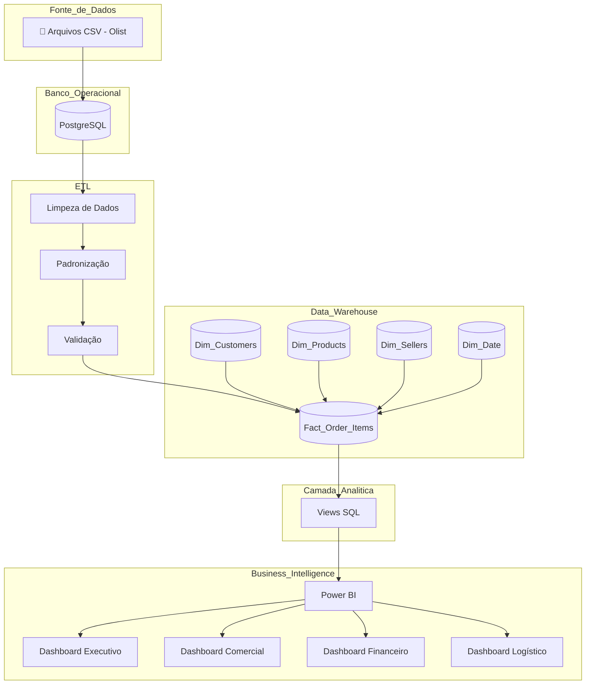

```mermaid
flowchart TD

    subgraph Fonte_de_Dados
        A[📁 Arquivos CSV - Olist]
    end

    subgraph Banco_Operacional
        B[(PostgreSQL)]
    end

    subgraph ETL
        C[Limpeza de Dados]
        D[Padronização]
        E[Validação]
    end

    subgraph Data_Warehouse
        F[(Fact_Order_Items)]
        G[(Dim_Customers)]
        H[(Dim_Products)]
        I[(Dim_Sellers)]
        J[(Dim_Date)]
    end

    subgraph Camada_Analitica
        K[Views SQL]
    end

    subgraph Business_Intelligence
        L[Power BI]
        M[Dashboard Executivo]
        N[Dashboard Comercial]
        O[Dashboard Financeiro]
        P[Dashboard Logístico]
    end

    A --> B
    B --> C
    C --> D
    D --> E
    E --> F

    G --> F
    H --> F
    I --> F
    J --> F

    F --> K
    K --> L

    L --> M
    L --> N
    L --> O
    L --> P
```

